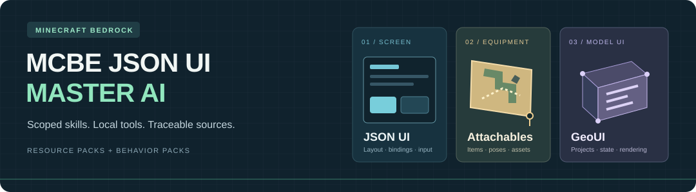
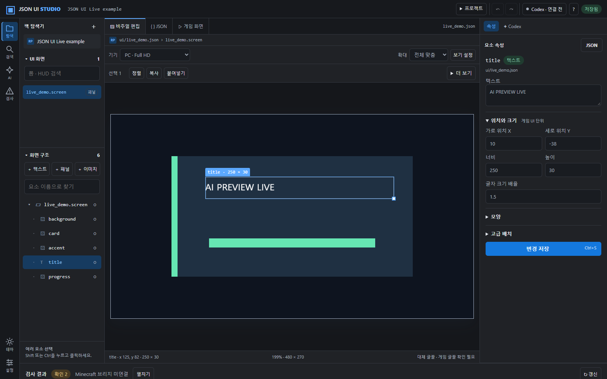
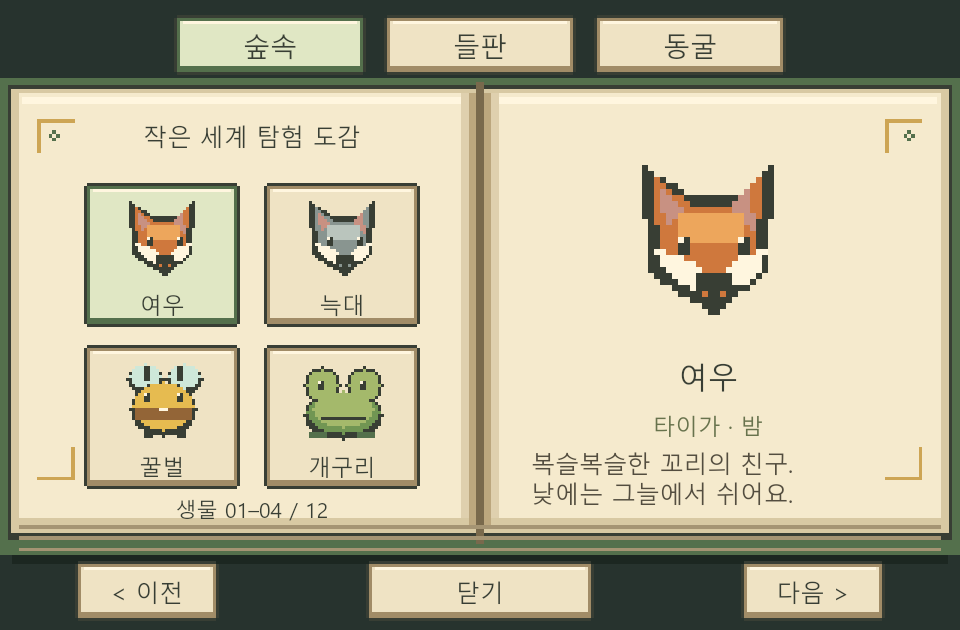

<p align="center">
  
</p>

<p align="center">
  <strong>Minecraft Bedrock UI를 설계하고, 팩을 연결하고, 근거를 확인하는 AI 작업 도구</strong><br>
  필요한 전문 스킬과 참조만 선택하고, 로컬 CLI로 결과를 검사합니다.
</p>

<p align="center">
  <a href="#빠른-시작">빠른 시작</a> · <a href="#지원하는-작업">지원 작업</a> · <a href="#예제로-살펴보기">예제</a> · <a href="#필요할-때-찾는-문서">문서</a>
</p>

---

## 지원하는 작업

| 작업 표면 | 이 저장소에서 다루는 내용 | 시작 스킬 |
| --- | --- | --- |
| **JSON UI** | HUD·채팅·서버 폼, 레이아웃, 바인딩, 텍스처, 상태별 로컬 미리보기 | [`mcbe-json-ui-master`](skills/mcbe-json-ui-master/SKILL.md) |
| **Chest GUI** | native container와 ActionForm 구분, 슬롯·페이지·응답 계약, Minato 프로젝트 검사 | [`mcbe-json-ui-chest-gui`](skills/mcbe-json-ui-chest-gui/SKILL.md) |
| **Attachables UI** | 장착 아이템의 모델, 양손·시점별 자세, 애니메이션과 리소스 연결 | [`mcbe-attachables-ui`](skills/mcbe-attachables-ui/SKILL.md) |
| **GeoUI** | GeouiStudio 프로젝트, 플레이어 렌더러, 상태 전달과 RP/BP 연결 | [`mcbe-geo-ui`](skills/mcbe-geo-ui/SKILL.md) |
| **팩 전체 통합** | 여러 기능의 소유권, 팩 순서, 머테리얼·텍스처·BP 상태 | [`mcbe-resource-pack-master`](skills/mcbe-resource-pack-master/SKILL.md) |

스킬은 작업 방법을 안내하고, 도구는 정해진 범위의 구조·레이아웃·참조를 검사합니다. **정적 검사와 로컬 미리보기의 성공은 Bedrock 실행 결과와 구분합니다.** 실제 화면·입력·동기화는 대상 클라이언트와 Content Log로 확인합니다.

## 빠른 시작

### Codex와 함께 보는 JSON UI 편집기

```powershell
npm run studio
```

`http://127.0.0.1:47832`에서 팩을 열고 화면·요소를 선택합니다. bridge. v2를 참고한 활동 메뉴·팩 탐색기·비주얼/JSON/게임 탭과 밝은/어두운 테마, 너비 조절 패널을 제공합니다. 왼쪽은 요소/화면 탭, 중앙은 한 줄 도구 모음으로 정리했습니다. 세부 기능은 ‘더 보기’와 ‘보기 설정’에서 엽니다. Ctrl+C/V/X로 요소를 복사·붙여넣기·잘라내기하며 Delete와 실행 취소를 지원합니다. [PC·태블릿·콘솔·모바일 미리보기](docs/90-studio-device-preview.md), 자동 정렬·다중 선택·간격과 크기 통일·그리드 배치·PNG 저장도 제공합니다. 상단 Codex 버튼에서 기존 로컬 세션을 검색·선택해 대화를 이어갈 수 있습니다. 제목·최근 메시지·연결 및 작업 상태도 표시합니다. 같은 선택과 미리보기를 Codex에 전달하고 Minecraft 창도 공유할 수 있습니다. [사용법과 한계](docs/86-json-ui-studio.md), [디자인 기준](docs/89-studio-editor-design.md)을 확인하세요. Studio는 Node.js 20 이상을 사용합니다.

폼·HUD·구성요소를 나눠 선택하고 폼은 전체 화면과 공통 컨트롤까지 표시합니다. 원본 팩 **A**를 복사한 작업 팩 **B**에서 편집하며, 변경 목록을 확인해 **A → B 가져오기 / B → A 적용**을 실행합니다. 양쪽 수정 충돌과 오래된 변경 목록은 적용을 막고, 이전 파일은 로컬 백업으로 보관합니다.



### 1. 저장소와 도구 준비

Git와 **Node.js 18.17 이상**이 필요합니다. 다음 명령은 저장소 루트에서 실행합니다.

```powershell
git clone https://github.com/boredape874/mcbejsonuimasterAI.git
cd mcbejsonuimasterAI
npm ci
node tools/setup.mjs
node tools/doctor.mjs --quick
```

파일을 읽고 터미널 명령을 실행할 수 있는 AI 클라이언트에서 이 폴더를 열고 [AGENTS.md](AGENTS.md)를 시작점으로 사용합니다. 기본 CLI 작업에는 MCP 서버가 필요하지 않습니다. PNG 미리보기는 설치 시 포함되는 선택 의존성을 사용합니다.

### 2. Codex에 스킬 설치

PowerShell에서 먼저 설치 계획을 확인한 뒤 적용합니다.

```powershell
.\scripts\install-skills.ps1
.\scripts\install-skills.ps1 -Apply
```

기본 대상은 `%USERPROFILE%\.codex\skills\`입니다. 첫 명령은 **dry-run**이며 파일을 변경하지 않습니다. 설치본과 저장소가 다르면 `drift-unreviewed`로 표시하고 적용을 중단합니다.

<details>
<summary>기존 설치본 업데이트 · 다른 설치 경로</summary>

변경 내용을 비교한 스킬만 `-ReviewedSkill`에 지정합니다. 다음은 한 스킬의 차이를 검토한 경우의 예입니다. 다른 미검토 차이가 남아 있으면 적용되지 않습니다.

```powershell
.\scripts\install-skills.ps1 -Apply -ReviewedSkill mcbe-attachables-ui
```

설치 위치는 `-TargetBase`로 바꿀 수 있습니다. 저장소가 관리하지 않는 설치 스킬은 기본적으로 유지합니다. [설치 스크립트](scripts/install-skills.ps1)와 [스킬 구성표](docs/03-skill-map.md)를 참고하세요.

</details>

### 3. 포함된 예제부터 검사

외부 팩을 다운로드하지 않고 실행할 수 있습니다.

```powershell
node examples/attachables/quest-map-recipe/verify.mjs
node tools/geoui-inspect.mjs --input examples/geoui/original-v6.geoui.json --json
node tools/chest-contract.mjs --contract examples/chest/action-form-27.json --json
```

결과의 `ok`, `complete`, `runtimeVerified`가 있으면 각각 확인합니다. 예를 들어 attachable 예제의 엔진 재질은 제공된 소스 밖에 있으므로 구조 오류가 없어도 `complete:false`가 남습니다.

## AI에 이렇게 요청하세요

```text
mcbe-json-ui-master를 사용해 HUD의 정렬과 간격을 수정해 줘.
기존 바인딩을 확인하고, 레이아웃 검사와 게임에서 확인할 부분을 구분해 줘.
```

```text
mcbe-resource-pack-master를 사용해 서버 퀘스트 상태를
GeoUI 카드와 손에 든 지도에 연결해 줘.
현재 RP/BP의 상태 생산자와 입력 경로부터 추적해 줘.
```

입문 설명은 `mcbe-json-ui-basics`, 정확한 이름·경로 조회는 `mcbe-json-ui-reference`, 화면 오류는 `mcbe-json-ui-debugging`에서 시작합니다. [프롬프트 모음](examples/prompts/README.md)과 [작업별 예제](examples/tasks/README.md)도 사용할 수 있습니다.

## 실제 작업 흐름

### 레이아웃 작성 → 검사 → 미리보기

```powershell
node tools/init-project.mjs my_hud --template rpg_hud
node tools/run.mjs workspace/my_hud/ir.yaml
npm run preview -- workspace/my_hud/ui.json workspace/my_hud/solved.json --report workspace/my_hud/preview-report.json
```

`workspace/my_hud/`에 원본 `ir.yaml`, 계산된 `solved.json`, 생성한 `ui.json`, `report.json`과 미리보기 결과가 생깁니다. 템플릿은 `minimal`, `rpg_hud`, `rpg_menu`입니다. Go가 있으면 Go 레이아웃 solver를 사용하고, 없으면 Node로 처리합니다.

레이아웃은 IR에서 수정하고 다시 생성합니다. 실제 게임용 바인딩·라우팅·텍스처 연결은 [생성 결과 마감 가이드](docs/46-tools-output-to-handcrafted-ui.md)에 따라 완성합니다. [IR 명세](docs/41-ir-spec.md) · [도구 사용법](docs/42-tools-reference.md)

미리보기에서 미지원 컨트롤이나 누락된 폰트·리소스 진단이 있으면 이미지가 생성돼도 종료 코드 1을 반환합니다. `preview-report.json`의 진단을 확인하고, 해당 영역을 실제 화면 검증과 구분하세요.

### 스타일과 제작 방법 선택

```powershell
node tools/design-library.mjs styles
node tools/design-library.mjs context --style cozy16 --role inventory,shop --input mixed
node tools/design-library.mjs method --method ui-kit-spec-first --style cozy16
```

선택한 스타일·작업에 필요한 카드와 출처만 가져옵니다. 로컬 비교 보드, 픽셀 제작 절차, 외부 스킬 분석은 [디자인 라이브러리](docs/72-design-library.md)와 [픽셀 제작 워크플로](docs/74-pixel-art-source-review.md)에서 이어집니다.

### 연결과 검증

| 확인할 것 | 도구 / 문서 |
| --- | --- |
| 최종 JSON UI의 상속·상태·텍스처·배치 | [`final-rp:render` 스킬](skills/mcbe-json-ui-final-rp-inspection/SKILL.md) |
| attachable / client entity의 정적 참조 그래프 | [`attachable-inspect`](docs/77-resource-pack-skills.md) |
| 재질·투명도·texture set·그래픽 모드 | [`material-audit`와 렌더링 스킬](skills/mcbe-resource-pack-rendering/SKILL.md) |
| 장비 교체·서버 상태·재접속·다른 관전자 | [상태와 수명주기](docs/81-geometry-ui-state-and-lifecycle.md) |
| 저장소 감사와 테스트 | `npm run check` |
| 고정 예제의 오프라인 평가 | `npm run eval:offline` |

`eval:live`는 실제 캡처와 로그를 요구합니다. 런타임 증거가 없으면 그 부분은 미검증으로 남습니다.

## 예제로 살펴보기

| 예제 | 포함 내용 |
| --- | --- |
| [NewUI · 작은 세계 탐험 도감](examples/newui-codex/README.md) | 직접 만든 생물 12종, 손에 든 책 + NPC 모델 초상화 + JSON UI, 설치·패키징·세션 검증 |
| [JSON UI Design System V2](examples/v2/README.md) | 독립 RP/BP 예제, 버튼 상태·타이포그래피·반복 레이아웃·PC/터치 크기 |
| [두 상태 퀘스트 지도](examples/attachables/quest-map-recipe/README.md) | 직접 만든 픽셀 텍스처, 아이템·아틀라스·매니페스트 연결, 양손·시점별 자세와 검증기 |
| [GeouiStudio v6 프로젝트](examples/geoui/original-v6.geoui.json) | 프로젝트 구조와 상태 연결을 검사할 수 있는 독립 원본 |
| [ActionForm 27칸](examples/chest/action-form-27.json) · [Native container 54칸](examples/chest/native-container-54.json) | 전송 방식이 다른 슬롯·페이지 계약 |
| [공개 디자인 레시피](data/design-recipes.public.json) | 출처와 재배포 범위를 구분한 측정 레시피 |

예제별 README와 검사 결과에 확인 범위가 기록됩니다. 계약 파일이나 정적 검사용 프로젝트를 완성된 게임 기능으로 취급하지 않습니다.

<a href="examples/newui-codex/README.md"></a>

## 필요할 때 찾는 문서

| 목적 | 읽을 문서 |
| --- | --- |
| 전체 구조와 스킬 선택 | [개요](docs/00-overview.md) · [스킬 맵](docs/03-skill-map.md) · [요청 분류](docs/57-hierarchical-task-router.md) |
| JSON UI 입문과 화면 구조 | [기본 개념](docs/11-basics-and-mental-model.md) · [파일 역할](docs/15-json-ui-file-role-catalog.md) |
| 바인딩·HUD·서버 폼 | [바인딩](docs/19-bindings-and-hardcoded-values.md) · [HUD 패턴](docs/17-community-patterns-string-score-hud.md) · [서버 폼 예제](docs/40-server-form-example-index.md) |
| Chest GUI | [설계·검사](docs/75-chest-gui.md) · [출처 검토](docs/76-chest-source-review.md) |
| Attachables·GeoUI·리소스팩 | [작업 흐름](docs/77-resource-pack-skills.md) · [Attachable 작성](docs/80-attachables-ui-authoring.md) · [GeoUI 스킬](skills/mcbe-geo-ui/SKILL.md) |
| 에셋·디자인·연구 | [바닐라 에셋](docs/13-vanilla-asset-workflow.md) · [디자인 자료](docs/72-design-library.md) · [AI·픽셀·게임 UI 연구](docs/78-skill-research.md) |
| 진단·팩 병합 | [실패 사례](docs/26-common-failure-modes.md) · [팩 병합](docs/20-pack-merge-playbook.md) |

전체 문서는 [`docs/`](docs/)에, 작업별 지침은 [`skills/`](skills/)에 있습니다. 도구·스키마는 `tools/`, `schemas/`, `data/`에 있으며 로컬 생성 결과와 내려받은 연구 자료는 Git에서 제외된 `workspace/`에 둡니다.

<details>
<summary>선택 사항: 미러 동기화와 로컬 에셋 조사</summary>

기존 동기화 스크립트는 필요한 미러만 생성하거나 갱신할 때 실행합니다. 일반 설치나 포함 예제 검사에는 필요하지 않습니다.

```powershell
# 서드파티 바닐라 비교 미러 → references/upstreams/MCBVanillaResourcePack/
.\scripts\sync-ztech-vanilla.ps1

# 공식 bedrock-samples의 선택 UI 파일 → references/official/bedrock-samples-ui/ (+ .lock.json)
.\scripts\sync-bedrock-samples-ui.ps1 -Ref main

# JSON UI 자료 저장소 → references/upstreams/mcbe-json-ui-resource/
.\scripts\sync-mcbe-json-ui-resource.ps1
```

부분 미러 검사:

```powershell
.\scripts\validate-json-ui-pack.ps1 -PackPath references\official\bedrock-samples-ui -AllowPartialUiDefs -AllowMissingTextures
node tools/sync-bedrock-samples-ui.mjs --check
node tools/vanilla-name-check.mjs common.close_button '#title_text'   # 바닐라에 있는 이름인지 확인
```

공식 샘플의 고정 리비전은 `references/official/bedrock-samples-ui.lock.json`(현재 `v1.26.50.4`)에 기록되며 위 `--check`가 네트워크 없이 커밋된 파일과 lock의 일치를 검사합니다. 이전 고정본과의 차이는 [바닐라 UI 변경 추적](docs/83-vanilla-ui-1.26.50-diff.md)을, 2026-10-03에 추가한 공식 문서·스키마·위키·애드온 출처와 바닐라 대조 결과는 [레퍼런스 확장과 근거 우선 정책](docs/84-reference-expansion-and-evidence-first.md)을 참고하세요. `node tools/vanilla-name-check.mjs`는 컨트롤·바인딩·변수·버튼 id·렌더러·텍스처·화면 파일에 더해 factory 이름, 컬렉션 이름, 미러가 있을 때의 팩 식별자(client entity·attachable·geometry·animation·controller·material 이름)와 1.26.50.4 문서화 Molang 쿼리(`data/molang-queries-1.26.50.json`)도 확인합니다.

개인 팩의 경로는 `config/sources.local.example.json`을 복사한 `config/sources.local.json`에만 둡니다. 로컬 파일을 대상으로 `validate:sources`를 실행한 뒤 `source:scan`, `catalog:build`, `design:search`를 선택합니다. 대규모 로컬 자료와 attachable·geometry 근거 추출은 [로컬 에셋 작업 흐름](docs/77-resource-pack-skills.md#로컬-에셋-활용)을 참고하세요.

</details>

## 출처와 검증 원칙

공식 문서는 이름과 계약을, 고정된 Mojang 샘플은 버전별 구현을, 실제 클라이언트와 Content Log는 실행 결과를 확인하는 근거로 사용합니다. 스킬은 출발점이 아니라 마지막 수단입니다. 모든 스킬은 대상 팩 → 고정 바닐라 샘플(`node tools/vanilla-name-check.mjs`) → 등록된 외부 출처(`node tools/design-library.mjs sources --source ID`) → 스킬 자체 참조 순서로 조사하고, 스킬 참조로만 답한 내용은 "inferred from skill guidance"로 표시합니다. 커뮤니티 자료·외부 스킬·로컬 팩은 출처와 적용 한계를 남기며, 공개된 파일이라는 이유만으로 재배포 권한을 가정하지 않습니다.

설계 자료는 필요한 파일만 조회합니다. 외부 원본 코드를 자동으로 실행하거나 설치하지 않으며, 이 저장소의 자료 추가가 모델 학습이나 성능 향상을 입증하는 것은 아닙니다. [출처 우선순위](docs/04-source-priority.md) · [자료 조사와 범위](docs/79-resource-source-review.md)
