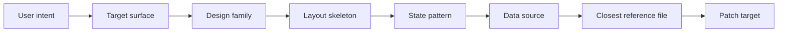
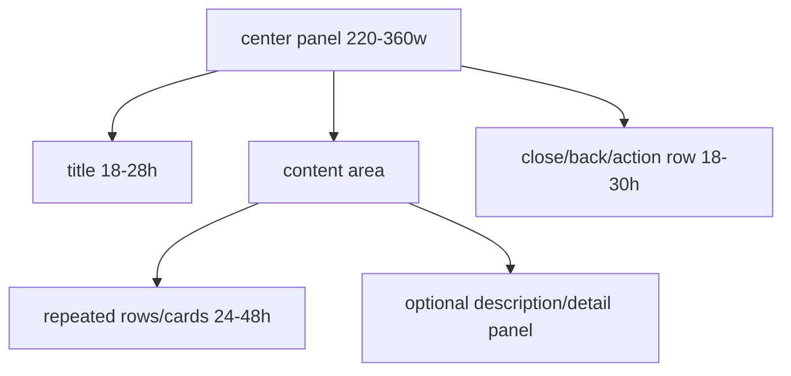
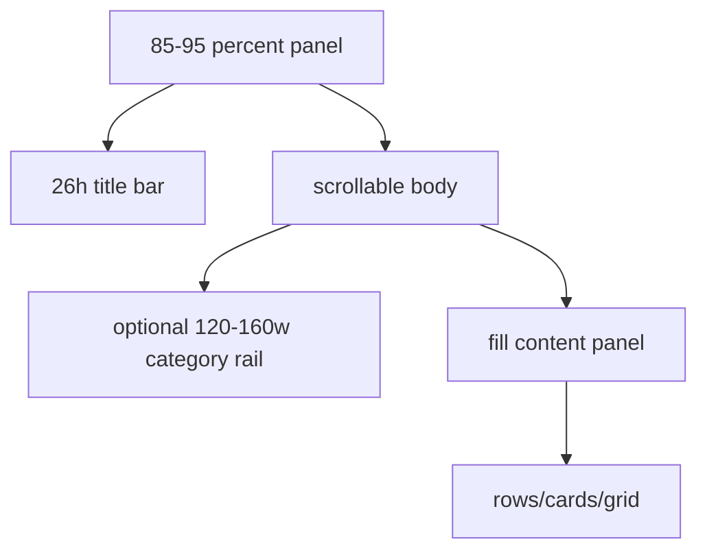
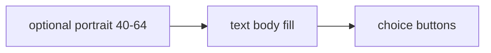
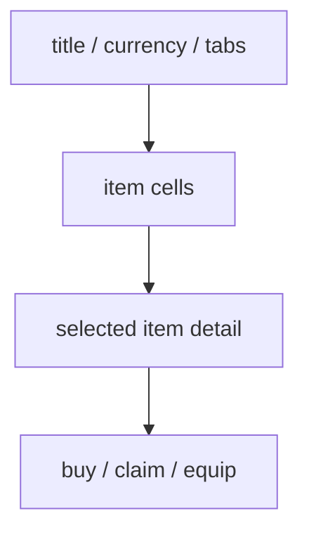
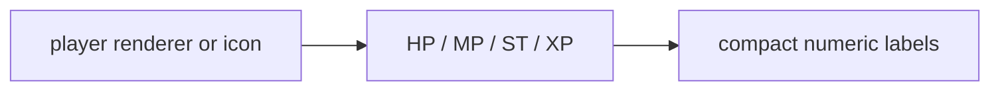
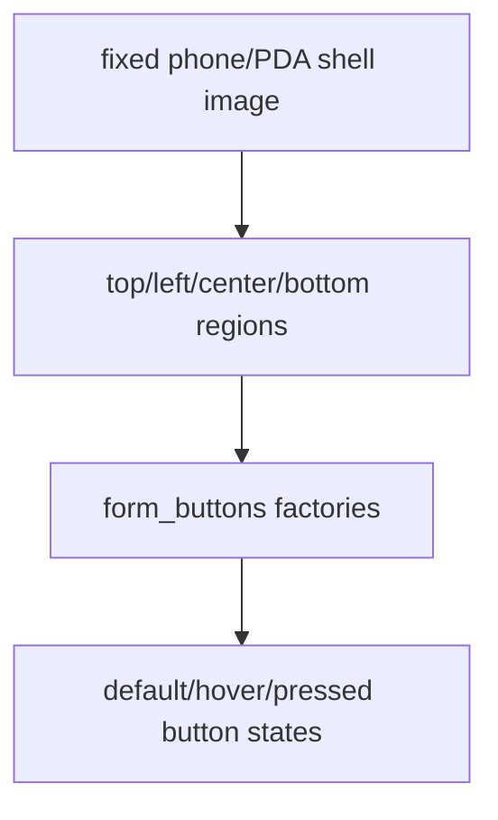
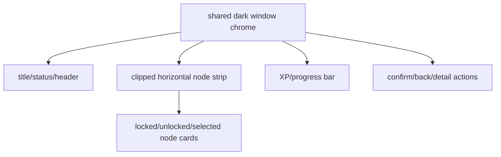

# Design Reference Atlas

Use this when the user asks for a good-looking Bedrock JSON UI, server form, HUD, loading screen, menu, or screen redesign.

This atlas is the visual-design layer above the task router:



Do not jump from a screenshot directly to JSON. First choose the design family and layout skeleton, then use IR/tools for geometry if the layout has repeated cards, grids, rows, or symmetric spacing.

## Design Selection Matrix

| User Wants | Design Family | Layout Skeleton | Open First | Use When | Avoid When |
| --- | --- | --- | --- | --- | --- |
| RPG HUD | compact RPG HUD | bottom-left portrait/status cluster + bottom bars + optional right stat rail | `docs/25-pmmp-json-ui-bridge.md`, `references/local-examples/rpg-hud/ui/rpg_hud.json` | HP/MP/ST/XP, PMMP or BP-driven values | user wants vanilla HUD unchanged except one small bar |
| Skill/stat window | compact RPG panel | fixed modal, header, stat cards, icon rows | `docs/40-server-form-example-index.md`, RPG stat/skill rows | dense server RPG menus | long story text or inbox-like content |
| Quest/NPC dialogue | dialogue/readable panel | bottom dialogue or framed NPC panel | `docs/39-design-recommendation-catalog.md`, `docs/40-server-form-example-index.md` | story text, options, NPC interaction | shop grids or item picking |
| Shop/inventory menu | item grid panel | header, category tabs, item grid, detail/action strip | `docs/40-server-form-example-index.md` | prices, items, rewards, kits | text-heavy pages |
| Modern server menu | modern cloud panel | large percentage panel, title bar, scrollable content, rounded buttons | `docs/40-server-form-example-index.md` | polished multi-page menus | very small mobile-only menus |
| Command/chat tool | utility sidebar | chat screen + side panel + collapsible categories | `docs/56-local-json-ui-reference-pack-analysis.md` | quick command buttons, formatting tools | normal gameplay HUD, unless explicitly requested |
| Hotbar redesign | hotbar transform | vertical grid or radial fixed offsets | `docs/56-local-json-ui-reference-pack-analysis.md` | custom controls or novelty UI | ordinary RPG HUD where hotbar must stay vanilla |
| Loading screen | cinematic loading | full-screen background + bottom/center progress | `docs/53-premium-ui-pattern-reference.md` | world join/save/loading visuals | server form progress bars |
| Tooltip polish | animated tooltip | hover panel + rarity frame + fade/size animation | `docs/56-local-json-ui-reference-pack-analysis.md` | inventory/item hover info | static HUD text |
| Interactable overlay | advanced HUD tool | overlay toggle + settings panel + sliders/renderers | `docs/56-local-json-ui-reference-pack-analysis.md` | minimap, editor/debug overlay | simple decorative HUD |
| Phone/PDA special form | diegetic device shell | fixed shell texture + mapped button regions | `docs/62-special-form-device-ui-patterns.md` | phone, quest book, guidebook, profile device | small normal action forms |
| Ability/progression game-mode form | maze progression suite | clipped horizontal node strip + XP/progress strip + shared dark window | `docs/64-motion-form-hud-reference.md` | skill trees, battlepass-like reward tracks, ability upgrades | simple one-page stat forms |
| Shop purchase flow | maze shop/purchase suite | product browser grid + modal purchase state machine | `docs/64-motion-form-hud-reference.md` | store pages that need confirmation/waiting/success/failure states | static product lists without interaction |
| Status/reward HUD | maze HUD overlay | effects/cooldowns/progress bars + reward overlay groups | `docs/64-motion-form-hud-reference.md` | game-mode HUD, cooldowns, timed effects, rewards | vanilla HUD-only tweaks |
| Battle command UI | battle command panel | actor cards + move/action buttons + compact bars | `docs/61-advanced-ui-set-file-pattern-routes.md` | RPG/turn battle menus | generic shop/list forms |
| Database/storage UI | grid/detail application | grid body + persistent search/filter/nav controls | `docs/60-advanced-ui-set-special-ui-reference.md` | encyclopedia, PC/storage, team menus | short one-page forms |

## Layout Skeletons

### Compact RPG Panel



Recommended dimensions:

| Part | Size |
| --- | --- |
| root | `220-360px` wide, `150-240px` high |
| header | `18-28px` high |
| stat row | `18-28px` high |
| card/list item | `32-48px` high |
| icon | `16-24px` square |
| gap | `2-6px` |

Use for `stats`, `skills`, `quests`, `guild`, `craft`, and small RPG menus.

### Modern Cloud Form



Recommended dimensions:

| Part | Size |
| --- | --- |
| root | `85%-95%` width and height |
| title bar | `24-30px` high |
| close button | `18-22px` square |
| category rail | `120-160px` wide |
| scroll bar | `5px` |
| content padding | `4-10px` |

Use for inbox, shop, recipe, friends/menu, notifications, large configuration panels.

### Bottom Dialogue



Recommended dimensions:

| Part | Size |
| --- | --- |
| root | `80%-95%` width, `55-95px` high |
| portrait | `40-64px` square |
| choice row | `24-32px` high |
| text line area | explicit label size, scroll if long |

Use for NPC speech, quests, cutscene text, short choices.

### Item Grid / Shop



Recommended dimensions:

| Part | Size |
| --- | --- |
| item cell | `42-70px` square for compact menus, larger for modern cloud |
| item icon | `24-40px` square |
| price/status label | `10-16px` high |
| action button | `24-36px` high |

Use when button identity is an item, reward, kit, recipe, or equipment piece.

### HUD Status Cluster



Recommended dimensions:

| Part | Size |
| --- | --- |
| portrait | `32-64px` square |
| bar width | `80-180px` |
| bar height | `5-12px` |
| label | outside bar if bar is under `10px` high |
| margin from hotbar/chat | verify against vanilla HUD |

Use title/actionbar/scoreboard data sources carefully. Do not remove vanilla hotbar unless requested.

### Diegetic Device Shell



Recommended dimensions:

| Part | Size |
| --- | --- |
| shell | `260-640px` wide, fixed aspect |
| top row | `18-34px` high |
| card region | `54-130px` high |
| icon | `32-72px` square |
| gap | `2-8px` |

Use for phone, PDA, guidebook, quest journal, profile card, and other special forms where button positions are part of the artwork.

### Maze Progression Suite



Recommended dimensions:

| Part | Size |
| --- | --- |
| node card | fixed size inside carousel; keep all states identical |
| progress bar | `5-10px` high; put labels outside thin bars |
| secondary labels | `9-14px` high with explicit `size` |
| gap | consistent `2-6px` within each strip |

Use for ability upgrades, skill trees, battlepass-like tracks, shop purchase flows, quest tabs, and status/reward HUD overlays. Start from `docs/64-motion-form-hud-reference.md` and open only the closest component file.

## State Pattern Matrix

| UI Element | Required States | Source Pattern | Notes |
| --- | --- | --- | --- |
| normal button | default, hover, pressed | vanilla `ui_common.json`, tutorial examples | all state controls must keep same size |
| toggle | checked, unchecked, hover variants | `common_toggles` examples | use clear toggle group names |
| server form button | default, hover, pressed, icon loading | `docs/53-premium-ui-pattern-reference.md` | keep `form_buttons` click routing stable |
| progression node | locked, unlocked, selected, claimed/available | `docs/64-motion-form-hud-reference.md` | state controls must share one card size |
| purchase popup | description, confirmation, waiting, success, failure | `docs/64-motion-form-hud-reference.md` | separate visual states from the router |
| command palette button | default, hover, pressed, hidden send | `docs/56-local-json-ui-reference-pack-analysis.md` | verify touch keyboard mapping |
| progress bar | empty, fill, optional cap/text | animated bar references | `clip_ratio` polarity must be checked |
| tooltip | hidden, visible, animated | `animated-hover-text` neutral reference | replace restricted rarity textures |
| scroll panel | viewport, content, scroll bar | `docs/35-scroll-and-carousel-patterns.md` | use explicit padding and scrollbar width |

## Data Source Fit

| Data Source | Best Design Use | Avoid |
| --- | --- | --- |
| static RP | decorative frames, fixed menus, style prototypes | live player values |
| server form collection | buttons, text body, icons, custom forms | high-frequency HUD bars |
| title payload | multiple HUD values, bars, hidden protocols | visible user-facing titles unless preserved |
| actionbar payload | compact summaries | multi-value parsing with long text |
| chat payload | notifications, protocol-driven message UI | very frequent updates |
| scoreboard collection | personal score, sidebar, list-driven HUD | many players/offline rows without cleanup |
| Script API BP | local prototypes, addon demos | PMMP production assumptions |
| PMMP | production server menus/HUD | unsupported client-only assumptions |

## Design Reference Evidence

Before finalizing a visual implementation, record:

```text
Design route:
- family:
- layout skeleton:
- state pattern:
- data source:
- closest reference:

Visual fit:
- explicit label sizes:
- repeated item size/gap:
- scroll/padding:
- hotbar/chat side effects:
- texture paths verified:
```

If the answer cannot name a closest reference file, the design route is incomplete.
