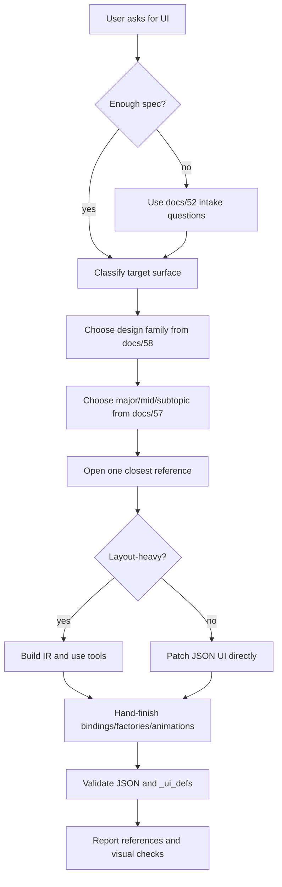
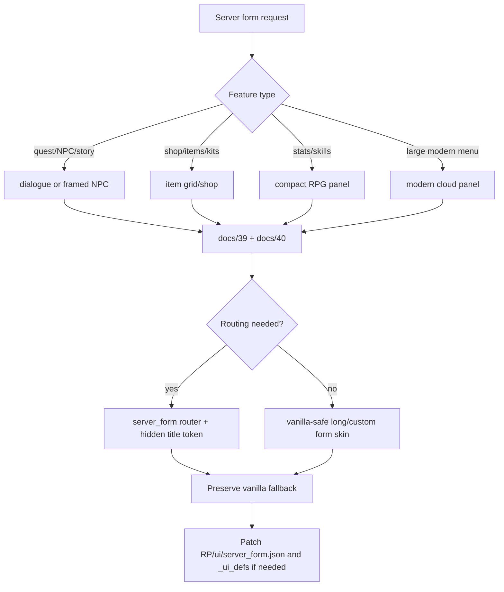
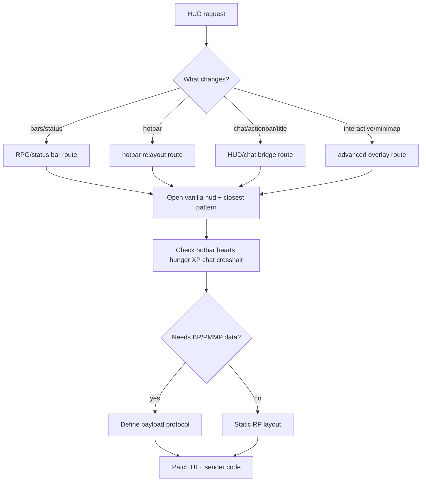
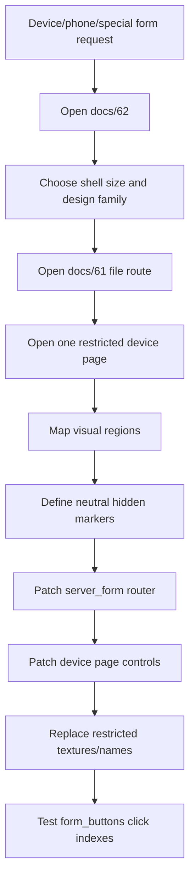
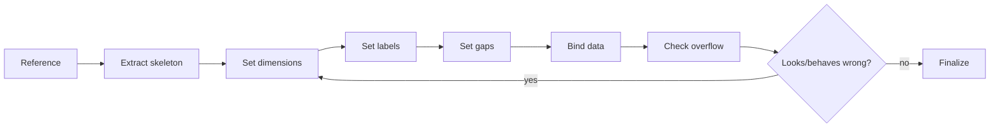
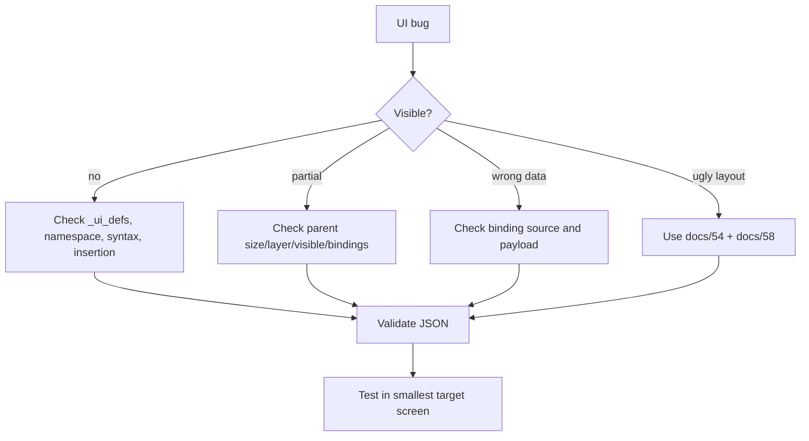
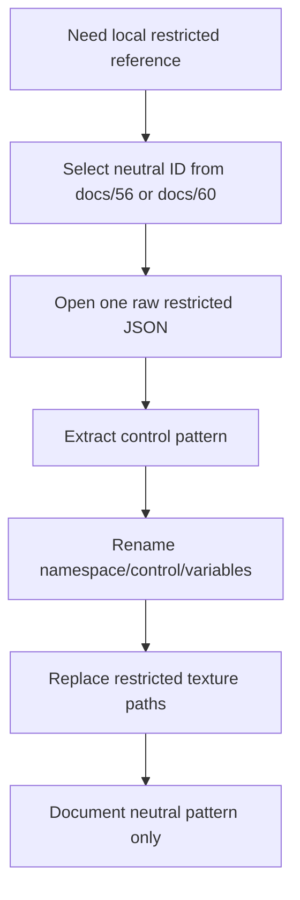

# Diagrammatic Workflows

Use this when AI behavior must be systematic. These diagrams are the mandatory process shapes for broad Bedrock JSON UI work.

## New UI Creation

## Server Form Design

## HUD Work

## Special Device Form

Use this for phone/PDA/profile/guidebook forms. It is a server-form route with a device shell, not a normal long-form skin.

## Design Fit Loop

Checklist:

- label has explicit `size`
- text scale fits height
- repeated controls use one item size and one gap
- scroll panels have explicit viewport, content, and scrollbar size
- state controls do not shift layout
- texture paths are verified or target-owned

## Debug Flow

## restricted Reference Handling

Never expose original archive names, server names, source comments, credits, or restricted texture paths in public docs.
