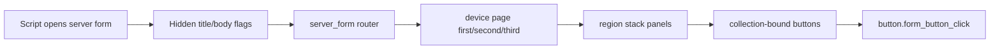

# Special Form Device UI Patterns

Use this when a server form should look like a handheld device, phone, compendium, quest book, profile card, or other diegetic interface.

The key idea: the UI is still driven by `server_form` data, but the visible layout is a fixed device shell with mapped button zones.

## Routing Flow



## Anatomy

| Layer | Job | JSON UI shape |
| --- | --- | --- |
| device background | fixed visual shell | full-size `image`, usually one large texture |
| route controller | chooses which page is visible | `server_form.json` hidden `#title_text` tests |
| region panels | named click/text zones on the shell | top/left/middle/bottom `stack_panel` groups |
| button factories | render only matching buttons in each region | `factory` with `collection_name: form_buttons` |
| shared button template | maps form button text/icon to a visual state | common button control with collection bindings |
| invisible flags | decide which region receives a button | string markers in `#form_button_text`, renamed for the target pack |

## What This Is For

Good fits:

- phone/PDA menus
- creature or item detail cards
- RPG character profile pages
- quest journal pages
- guidebook pages
- multi-page database UI
- stylized server menu that should not look like vanilla action forms

Bad fits:

- simple confirmation boxes
- small settings forms with 2-4 vanilla buttons
- menus that must scale to unknown button counts without a scroll area

## Layout Rules

- Treat the device shell as a coordinate map. Do not let dynamic text resize the shell.
- Define one stable `size` per region. Text overflow should be solved by smaller `font_scale_factor`, shorter script text, or a scroll/detail page.
- Use `stack_panel` only inside a region that has a fixed width/height.
- Keep button state controls the same size across default, hover, and pressed.
- Use one hidden marker per region. Do not infer region from visible text.
- Keep navigation buttons in persistent regions so users build muscle memory.
- If the UI has desktop and pocket variants, make separate shell dimensions instead of scaling font sizes with screen width.

## Recommended Dimensions

These are starting points, not rules:

| Part | Compact device | Wide device |
| --- | --- | --- |
| outer shell | 260-360 x 180-260 | 420-640 x 240-360 |
| top action row | 18-28 high | 24-34 high |
| icon slot | 32-56 square | 48-72 square |
| small text row | 10-16 high | 12-18 high |
| large card button | 54-90 high | 80-130 high |
| mini action button | 16-24 high | 20-30 high |
| internal gap | 2-6 | 4-8 |

## Compact Routed Form Variant

Use this when the form is not a literal phone shell, but still needs an app-like custom layout with compact cards, reusable button states, and a small route surface.

Open order:

1. `references/restricted/advanced-ui-set-ui/restricted-suite-c-rp/ui/server_form.json`
2. `references/restricted/advanced-ui-set-ui/restricted-suite-c-rp/ui/creaturesv.json`
3. `references/restricted/advanced-ui-set-ui/restricted-suite-c-rp/ui/creaturebt.json`

Extract:

- router panel that hides vanilla `long_form` only for a custom title prefix
- compact body panel split into main and team/detail views
- `form_buttons` grid/stack usage instead of hardcoded fake data
- shared button templates with identical default/hover/locked geometry
- texture metadata from `textures/ui/buttons/*.json` only after replacing paths with target-pack assets

Recommended starting dimensions:

| Part | Compact app form |
| --- | --- |
| root panel | 280-480 wide, 160-300 high |
| top/header row | 18-32 high |
| card cell | 54-110 wide, 24-64 high |
| icon in card | 18-36 square |
| card label | 10-16 high, `font_scale_factor` 0.65-0.9 |
| scrollbar | 4-6 wide |

## Implementation Steps

1. Build or choose a neutral shell texture.
2. Place the shell in a single image control.
3. Define named region panels over the shell: top, left, center, bottom, side actions.
4. Add one `factory` per region, all reading `form_buttons`.
5. In each region item, bind `#form_button_text` and show only when the hidden marker matches.
6. In the shared button template, bind:
   - `#form_button_text`
   - `#form_button_texture`
   - `#form_button_texture_file_system`
7. Route clicks with `button.form_button_click`.
8. Keep a vanilla `long_form` fallback for unmatched titles.
9. Document the script-side marker protocol next to the BP/PMMP code that opens the form.

## Script Data Contract

The script side should send data as structured regions, then encode it into form buttons:

```text
title flag: device.page.profile
button region: region.top_action
button visible label: Back
button icon: textures/ui/...
click index: original server form button index
```

Do not expose region markers as visible player text. Strip or hide them inside JSON UI bindings.

## Common Failure Modes

- Button appears in the wrong region: marker collision or missing `binding_type: collection`.
- All buttons overlap: region panel uses `panel` where a `stack_panel` was expected, or item size is larger than region.
- Text looks too large: label has no explicit height or `font_scale_factor` is copied from a wider screen.
- Icons do not show: `#form_button_texture_file_system` binding missing or texture path not owned by the pack.
- Clicks do nothing: missing `button_mappings` to `button.form_button_click`.
