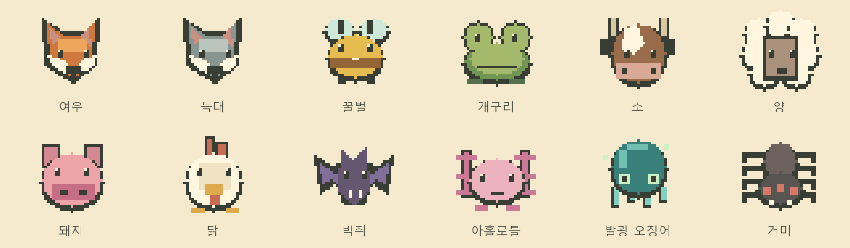

# NewUI · 작은 세계 탐험 도감

숲·들판·동굴의 생물 12종을 살펴보는 Bedrock 예제입니다. 같은 책을 세 계층으로 연결합니다.

- **Attachables**: 손에 든 닫힌 책. 양손·1인칭·3인칭 자세를 따로 정의합니다.
- **GeoUI**: 전용 NPC의 모델을 `actor_portrait_renderer`로 띄운 펼친 책입니다.
- **JSON UI**: 범주 탭, 생물 선택, 설명, 이전·다음·닫기를 담당합니다.


위 이미지는 원본 픽셀 에셋과 계산된 배치를 합친 **디자인 시안**입니다. 게임 캡처가 아니며, 실제 NPC 모델 투영과 Minecraft 글꼴을 재현한 렌더가 아닙니다.

## 설치하고 열기

1. 별도 테스트 월드에 `BP`와 `RP`를 함께 적용합니다. 최소 대상은 Bedrock `1.21.100`, 안정 Script API `@minecraft/server 2.1.0`입니다.
2. **치트 사용**을 켭니다. NPC `/dialogue` 명령에 필요합니다. 베타 API와 교육용 기능은 이 예제의 요구 사항이 아닙니다.
3. `/newui:book`으로 책을 받고 아이템을 사용합니다. 인벤토리에 빈자리가 없으면 지급하지 않습니다. `/newui:open`으로도 열 수 있습니다.
4. 위쪽 범주와 왼쪽 생물을 선택합니다. 이전·다음은 전체 12종을 순환하며, 닫기 또는 취소로 나갑니다.

선택한 생물은 플레이어별로 저장됩니다. 예제는 12종 전체를 보여 주는 열람용 도감이며, 획득·보상·발견률을 구현했다고 표시하지 않습니다. 다른 플레이어의 선택 상태를 공유하지 않고 기존 장비를 교체하지 않습니다.

마지막 화면 전환 뒤 6,000틱(정상 속도에서 약 5분)이 지나면 임시 도감 세션을 정리합니다.

제거가 실패한 NPC는 재시도합니다. 부분 초기화된 NPC가 계속 로드되지 않아 재시도 제한도 넘긴 경우에는 경고 로그를 남기므로 해당 엔티티를 운영자가 확인해야 합니다.

`install.ps1`은 BP/RP를 새 개발 팩 폴더에 복사하고 `.mcaddon`을 만드는 로컬 도구입니다. 기본값은 계획 출력이며, `-Apply`를 붙이면 실행합니다. 이미 있는 대상 디렉터리나 패키지는 덮어쓰지 않습니다. 게임의 월드 팩 선택은 별도입니다.

```powershell
./examples/newui-codex/install.ps1 -GameRoot 'YOUR_COM_MOJANG_DIRECTORY'
./examples/newui-codex/install.ps1 -GameRoot 'YOUR_COM_MOJANG_DIRECTORY' -Apply
```

## 재생성과 수정

저장소 루트에서 실행합니다. 생성 파일을 고치면 다음 빌드에서 바뀌므로 해당 원본을 수정하세요.

```powershell
node examples/newui-codex/build.mjs
node examples/newui-codex/verify.mjs
```

| 원본 | 소유하는 결과 |
| --- | --- |
| [catalog.json](catalog.json) | 3범주·12생물, 이름·서식지·설명, BP/RP의 동일한 순서 |
| [layout/ir.yaml](layout/ir.yaml) | 16개 화면 영역과 16개 배치 제약 |
| [build-art.mjs](build-art.mjs) | 자체 제작한 RGBA 아이콘, 책 아틀라스, 상태별 버튼·nine-slice |
| [build-rp.mjs](build-rp.mjs) | NPC 초상화·손에 든 책 모델, 애니메이션, JSON UI와 아틀라스 등록 |
| [build-bp.mjs](build-bp.mjs) | NPC·아이템 정의, 12개 대화 scene, 매니페스트 |
| [BP/scripts/main.js](BP/scripts/main.js) | 아이템/명령 입력, 플레이어별 세션, NPC 생성·정리 |

범주별 4종, 총 12종은 이 예제의 명시적 계약입니다. 항목 수를 늘릴 때는 페이지와 입력 매핑도 함께 변경해야 합니다. 기본 `server_form`이나 플레이어 엔티티를 덮어쓰지 않습니다. NPC 화면을 수정하는 다른 RP와 함께 사용할 때는 `npc_interact_screen` 소유권을 병합해야 합니다.

### 디자인 근거

Fantasy RPG의 양쪽 책 페이지를 기본 구조로 잡고 Cozy 계열의 크림·잎색·금색을 사용했습니다. 글과 버튼은 움직이지 않으며 모델만 짧게 열리고 넘겨집니다. 32×32 생물 그림은 같은 팔레트 역할과 투명 배경을 사용합니다. 선택·hover·pressed 텍스처를 분리하고 이름과 설명은 native label로 유지합니다.



## 확인 범위

정적 검사는 JSON 파싱, 레이아웃, PNG/UV/애니메이션 참조, NPC 버튼 순서, 일반 NPC fallback, 세션의 지연·중복·다중 사용자 경계를 검사합니다. 일반 그래프 검사에 남는 엔진 재질과 동적 skin 선택은 별도 근거입니다.

**Bedrock 런타임 미검증**: 게임에서 활성화한 후 실제 책 크기·투영·버튼 정렬·한글 줄바꿈, 양손 시점, 마우스/터치/컨트롤러, 두 플레이어 동시 사용, 닫기/재접속과 최신 Content Log를 확인해야 합니다. `actor_portrait_renderer`를 지원하지 않는 오프라인 렌더러의 결과로 이 항목을 통과 처리하지 않습니다.

## 출처와 재사용

사용자가 제공한 로컬 도감의 **아이템 → NPC 대화 → 모델 초상화 → native 버튼** 연결 방식을 분석했습니다. 원본 맵의 모델·텍스처·구조·스크립트는 이 예제에 포함하지 않았습니다. 이 디렉터리의 새 코드와 에셋은 [MIT](LICENSE.md)입니다.

API 근거: [NPC dialogue](https://learn.microsoft.com/en-us/minecraft/creator/documents/npcdialogue), [Script event 문맥](https://learn.microsoft.com/en-us/minecraft/creator/documents/scripting/events), [커스텀 명령](https://learn.microsoft.com/en-us/minecraft/creator/documents/scripting/custom-commands). 기술별 경계는 [NPC portrait 스킬 참조](../../skills/mcbe-geo-ui/references/npc-portrait-ui.md)를 읽으세요.
